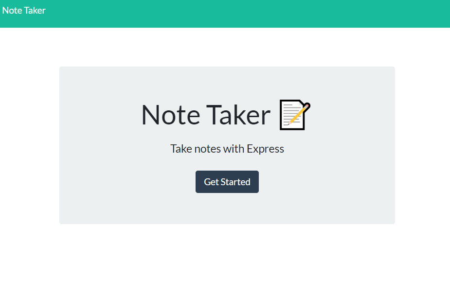

# NoteTaker

## Description

The task is to mofidy a starter code to create an application that can be used to write and save notes. This application will use express.js as the backend and will save and retrieve note data from a JSON file.

[Heroku deployment](https://notetakerforbootcamp-app.herokuapp.com/)
[Github](https://github.com/HCTyler/NoteTaker)

## Table of Contents

[Installation](#installation)

[License](#license)

## Installation

To install necessary dependencies for this project, run the following command:

>npm install, node server.js

## License

This project is licensed under the MIT license.

## Questions

If you have any other questions about the repo, contact me at undefined. You can find more of my work at [HCTyler](https://github.com/undefined)
